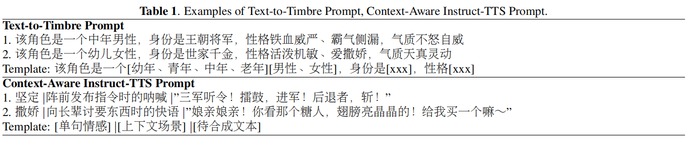
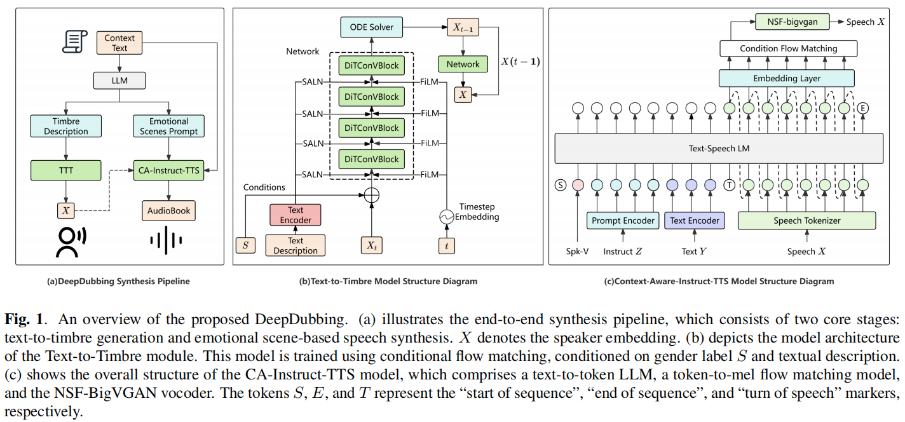
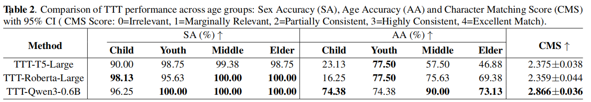
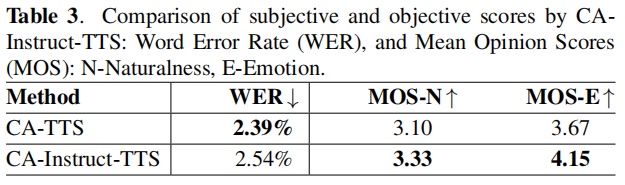

# DeepDubbing: End-to-End Auto-Audiobook System with Text-to-Timbre and Context-Aware Instruct-TTS

[](https://github.com/Akshay090/svg-banners)

<div align="center">
    <a href="https://arxiv.org/abs/2509.15845"></a>
    <a href="https://tme-lyra-lab.github.io/DeepDubbing"></a>
</div>

## 🗞 News

- [2025-09-19] Initial release of arXiv paper.
- [2025-09-25] Launch of demo page for audiobook synthesis.
- [Coming soon...] Release of BookVoice-50h dataset on Hugging Face.

## 🗓️ Release Plan

- Demo page for audio samples
- BookVoice-50h demo dataset
- Full BookVoice-50h dataset with extended timbre/emotion annotations
- End-to-end inference code for raw text → audiobook generation

## 🎯 Introduction

DeepDubbing is the first end-to-end automated system for multi-character audiobook production, reimagining how immersive audio content is created. It tackles two critical pain points in traditional workflows:

- Manual, subjective selection of character timbres (a time-consuming process for producers).
- Disconnected speech synthesis that lacks emotional consistency with narrative context.

By combining a Text-to-Timbre (TTT) model (generates speaker embeddings from natural language descriptions) and a Context-Aware Instruct-TTS (CA-Instruct-TTS) model (synthesizes speech with emotion-scene guidance), DeepDubbing automates script analysis → timbre generation → expressive synthesis — slashing production costs and time while raising audio quality.

## ✨ Highlights

- 🚀 First end-to-end auto-audiobook pipeline with text-guided timbre control and context-aware synthesis (no manual audio editing required).
- 🎭 Fine-grained timbre attributes (gender, age, Identity, personality) controllable via natural language (e.g., "female, Youth, Pharmacist, gentle and warm", the specific template is shown in Table 1).
- 🎙️ 44+ emotion-scene categories (e.g., "angry, arguing in a marketplace", the specific template is shown in Table 1) for expressive speech, derived via LLM context parsing.
- 📚 50 hours of synthetic audiobooks (BookVoice-50h dataset) with aligned timbre descriptions, emotion-scene labels, and speech-text pairs.
- 📈 Superior synthesis quality: CA-Instruct-TTS achieves MOS-E (emotion) = 4.15 and MOS-N (naturalness) = 3.33, outperforming baseline TTS systems.



## 🛠️ Pipeline Overview



<!-- - Text & Context Parsing:
  - A Large Language Model (LLM) identifies characters and generates Gender|Age|Personality timbre descriptions.
  - The same LLM extracts Emotion|Contextual Scenario instructions from narrative text.
- Text-to-Timbre (TTT) Generation:
  - Conditional Flow Matching (CFM) generates speaker embeddings from text descriptions.
  - Uses Qwen3-Embedding-0.6B for text encoding + FiLM/SALN for multi-level conditioning.
- Context-Aware Instruct-TTS Synthesis:
  - Fuses speaker embedding, dialogue text, and emotion instructions via a Transformer-based acoustic model.
  - NSF-BigVGAN vocoder generates final speech audio. -->

We aim to build a fully automated pipeline that converts raw book text into high-quality, multi-speaker audiobooks with context-aware expressiveness. The overall workflow, depicted in Fig. 1 (a), consists of three main steps:

- **Step 1:** The entire book text is processed by a large language model (LLM), which identifies all characters and generates a structured timbre description for each. This description serves as input to the TTT model to produce a corresponding speaker embedding.
- **Step 2:** The same LLM analyzes the narrative context to generate emotion-scene instructions for each dialogue segment.
- **Step 3:** The CA-Instruct-TTS model synthesizes expressive and contextually appropriate speech for each character based on three inputs: the generated speaker embedding, the current sentence text, and the emotion-scene instruction.

This LLM-powered context parsing and dual-instruction generation mechanism enables fully automated, end-to-end expressive multi-participant audiobook synthesis.

## 🔍 Key Capabilities

### 🎤 Text-to-Timbre (TTT) Control

Generate speaker embeddings through precise timbre description text:

- Attribute Accuracy: As shown in Table 1, all the indicators of the TTT-Qwen3-0.6B model have reached the optimum or are highly competitive.
- Timbre Diversity: It supports user-defined timbre descriptions, and the speaker embedding generation results have good diversity.
- Efficiency: Conditional flow matching enables the embedding generation speed to be faster than that of traditional diffusion methods.



### 🎧 Context-Aware Speech Synthesis

Synthesize speech with emotion and scene context:

- Emotion Expression: 44+ emotion categories with MOS-E = 4.15 (vs. baseline TTS: 3.67).
- Context Aware: LLM-derived instructions ensure speech matches narrative scenarios (e.g., "whispering in a library").
- Naturalness: MOS-N = 3.33 (vs. baseline TTS: 3.10) with a low word error rate (WER = 2.54%).
  Note: The baseline model directly inputs text and corresponding speech without using emotional scene instructions

<p align="center"></p>

## 📝 Citation

If you use DeepDubbing or the BookVoice-50h dataset in your research, please cite our work:

```bibtex
@article{yourname2025deepdubbing,
  title={DeepDubbing: End-to-End Auto-Audiobook System with Text-to-Timbre and Context-Aware Instruct-TTS},
  author={Dai, Ziqi and Chen, Yiting and Xu, Jiacheng and Xie, Liufei and Wang, Yuchen and Yang, Zhenchuan and Bai, Bingsong and Gao, Yangsheng and Zhou, Wenjiang and Zhao, Weifeng and Zhou, Ruohua },
  journal={arXiv preprint arXiv:2509.15845},
  year={2025}
}
```

## 📄 License

This project is licensed under the MIT License.

## 🙏 Acknowledgments

1.We borrowed a lot of code from Matcha-TTS.
2.We borrowed a lot of code from CosyVoice.
3.We borrowed a lot of code from Qwen3.
4.We borrowed a lot of code from BigVGAN

## Disclaimer

The content provided above is for academic purposes only and is intended to demonstrate technical capabilities. Some examples are sourced from the internet. If any content infringes on your rights, please contact us to request its removal.
