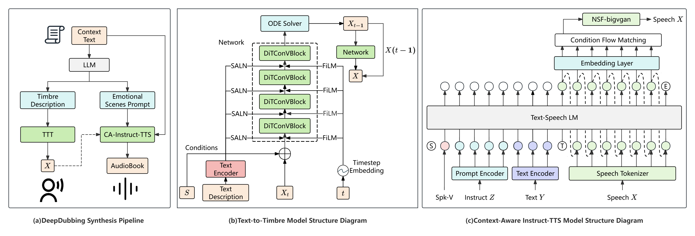

# DeepDubbing: End-to-End Auto-Audiobook System with Text-to-Timbre and Context-Aware Instruct-TTS

[](https://github.com/Akshay090/svg-banners)

<div align="center">
    <a href="https://arxiv.org/abs/2509.15845"></a>
    <a href="https://tme-lyra-lab.github.io/DeepDubbing"></a>
</div>

## 🗞 News

- [2025-XX-XX] Initial release of arXiv paper.
- [2025-XX-XX] Launch of demo page for audiobook synthesis.
- [2025-XX-XX] Release of BookVoice-50h dataset on Hugging Face.

## 🗓️ Release Plan

- Demo page for audio samples
- BookVoice-50h demo dataset
- Full BookVoice-50h dataset with extended timbre/emotion annotations
- Pre-trained Text-to-Timbre (TTT) and Context-Aware Instruct-TTS model checkpoints
- End-to-end inference code for raw text → audiobook generation

## 🎯 Introduction

DeepDubbing is the first end-to-end automated system for multi-character audiobook production, reimagining how immersive audio content is created. It tackles two critical pain points in traditional workflows:

- Manual, subjective selection of character timbres (a time-consuming process for producers).
- Disconnected speech synthesis that lacks emotional consistency with narrative context.

By combining a Text-to-Timbre (TTT) model (generates speaker embeddings from natural language descriptions) and a Context-Aware Instruct-TTS (CA-Instruct-TTS) model (synthesizes speech with emotion-scene guidance), DeepDubbing automates script analysis → timbre generation → expressive synthesis — slashing production costs and time while raising audio quality.

## ✨ Highlights

- 🚀 First end-to-end auto-audiobook pipeline with text-guided timbre control and context-aware synthesis (no manual audio editing required).
- 🎭 60+ fine-grained timbre attributes (gender, age, personality) controllable via natural language (e.g., "female, 25, gentle and warm").
- 🎙️ 44+ emotion-scene categories (e.g., "angry, arguing in a marketplace") for expressive speech, derived via LLM context parsing.
- 📚 50 hours of synthetic audiobooks (BookVoice-50h dataset) with aligned timbre descriptions, emotion labels, and speech-text pairs.
- 📈 Superior synthesis quality: CA-Instruct-TTS achieves MOS-E (emotion) = 4.15 and MOS-N (naturalness) = 3.33, outperforming baseline TTS systems.

## 🛠️ Pipeline Overview



- Text & Context Parsing:
  - A Large Language Model (LLM) identifies characters and generates Gender|Age|Personality timbre descriptions.
  - The same LLM extracts Emotion|Contextual Scenario instructions from narrative text.
- Text-to-Timbre (TTT) Generation:
  - Conditional Flow Matching (CFM) generates speaker embeddings from text descriptions.
  - Uses Qwen3-Embedding-0.6B for text encoding + FiLM/SALN for multi-level conditioning.
- Context-Aware Instruct-TTS Synthesis:
  - Fuses speaker embedding, dialogue text, and emotion instructions via a Transformer-based acoustic model.
  - NSF-BigVGAN vocoder generates final speech audio.

## 🔍 Key Capabilities

### 🎤 Text-to-Timbre (TTT) Control
Generate speaker embeddings with precise attribute control:

- Attribute Accuracy: 99.06% gender accuracy (adults) and 77.97% age-group accuracy with TTT-Qwen3-0.6B.
- Timbre Diversity: Supports 60+ personality traits (e.g., "serious", "playful", "melancholic") with a 2.87 CMS (Character Matching Score).
- Efficiency: Conditional Flow Matching enables 2× faster embedding generation than traditional diffusion methods.

### 🎧 Context-Aware Speech Synthesis
Synthesize speech with emotion and scene context:

- Emotion Expression: 44+ emotion categories with MOS-E = 4.15 (vs. baseline TTS: 3.67).
- Context Alignment: LLM-derived instructions ensure speech matches narrative scenarios (e.g., "whispering in a library").
- Naturalness: MOS-N = 3.33 (vs. baseline TTS: 3.10) with a low word error rate (WER = 2.54%).

## 📝 Citation
If you use DeepDubbing or the BookVoice-50h dataset in your research, please cite our work:

```bibtex
@article{yourname2025deepdubbing,
  title={DeepDubbing: End-to-End Auto-Audiobook System with Text-to-Timbre and Context-Aware Instruct-TTS},
  author={Your Name and Co-authors},
  journal={arXiv preprint arXiv:XXXX.XXXXX},
  year={2025}
}
```

## 📄 License
This project is licensed under the MIT License.

## 🙏 Acknowledgments
Built with contributions from [Your Institution/Team] and open-source tools (Qwen3, Diffusion Transformer, NSF-BigVGAN, etc.).

Thanks to Tencent Music Entertainment Lyra Lab for dataset and computing support.